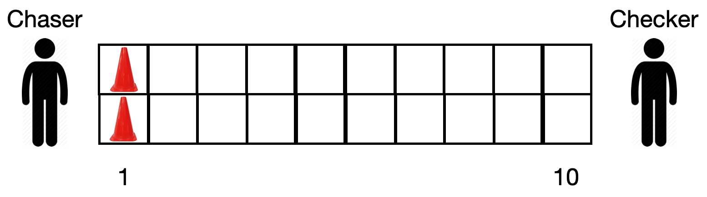

# OOSD3 Exam, May 2020

## Introduction

There are three parts to the exam. Each one uses its own main class. To run the
code for each part, just right-click on the appropriate main class and select

```
Run As > Java Application
```

## Part 1. Canaveral

An excited kid is watching a rocket launch at Cape Canaveral. An announcer does
the countdown, beginning at "10" and ending with "Liftoff". The kid shouts
"Yay!" five times at random intervals (which you can take to be less than 2
seconds). Write the `Announcer` and `Kid` classes so that they run concurrently.
Simulate speaking (or shouting) with a print statement. Write `Announcer` by
subclassing `Thread` and write `Kid` by implementing `Runnable`. Make sure that
they are running concurrently by checking that your output is interleaved

Use `Canaveral` as your main class.


## Part 2. Kids' Game

Two kids are playing a game in their tiled hallway. The square tiles are pretty
large so that the hallway is two tiles wide and ten tiles long. In the game, one
of the kids is the chaser and the other is the checker. There are two plastic
cones on the first two tiles.



The game proceeds as follows.

The chaser does the following repeatedly.

They wait a random amount of time (which you can take to be less than 2
seconds). They then move each of the two cones forward one square, left cone
first, then right cone.

The checker is just beyond the end of the hallway and has their back turned.
They wait a random amount of time (which you can again take to be less than 2
seconds). They then turn around, and if they see one cone ahead of the other,
they win. On the other hand, if the chaser moves both cones to the 10th row,
the chaser wins.

Use `KidsGame` as the main class. Write the `Chaser` and `Checker` classes so
that they both run on separate threads. The chaser should know about the
position of the two cones (as integers between 1 and 10). You can simulate the
checker turning around to check the cones by having the checker call a boolean
method on the chaser that returns `true` if the two cones are level. When the
chaser moves one of the cones, the application should print out a message
saying:

```
Chaser has the left cone to row 5.
```

When the conditions for one or other player winning are met, the application
should print one of the following messages:

```
Chaser wins!
```

or

```
Checker wins!
```

In both cases, the application should exit at that point and not continue
running any longer.

## Part 3. Salon

In a hairdressing salon, new clients arrive at random intervals (which you can
take to be a fraction of a second). Each client is automatically given a number
(Client 1, Client 2, etc.). A receptionist receives the new clients as they
arrive and directs them to a waiting area that has 5 seats. It's not possible to
enter the salon unless there is a free seat in the waiting area. When the
hairdresser is ready, they ask the client that has been waiting the longest to
take seat in the hairdressing area. Each client takes a different amount of time
to serve (which you can simulate as being random, but less than 2 seconds).

Write the `Receptionist` and `Hairdresser` classes so that they run concurrently
on their own threads. Also write a `WaitingArea` class to hold the clients. The
receptionist cannot direct a client to the waiting area if all 5 seats are full.
If the waiting area is empty, the hairdresser has no-one to serve.

Use the `Salon` class as your main class.
